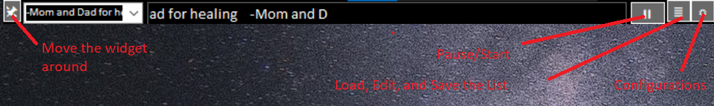

-----------------
PrayerReminder:
-----------------

Do you need an easy way to rember to pray for others each day, if so this app is for you!

Overview:
- This is an Always On Screen Widget, Prayer Reminder with autoclose and open on first computer boot of the day

Always On Screen Widget:
- Pin: Click the pin to reposition or resize
- '||' (pause icon): to pause speaking and scrolling
- List icon: to see your list favorites
- Gear icon: to adjust the app's settings

List:
- Reference List
- Load from file txt or md
- Save button

Settings:
- Scroll speed
- Speak repeat
- Select sequential or random reading mode
- Turn off/on Windows Notifications Messages
- "Exit" button to quit the app

-----------------          
ChangeLog:
- v1.0 Initial version

-----------------
Acknowledgments:
- Icon:
    Creative Commons (Attribution 4.0 International)
    Kalash

-----------------
Suggestions?
 - d e v @ s o u e r s . o r g